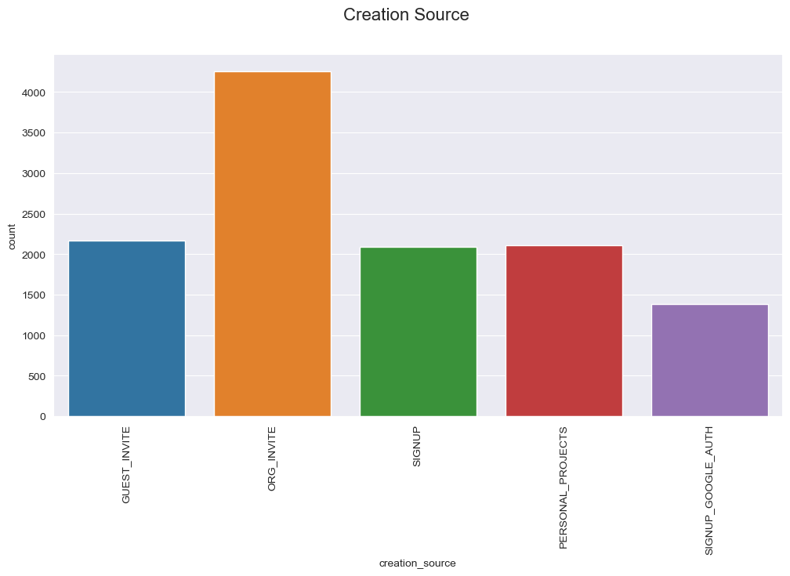
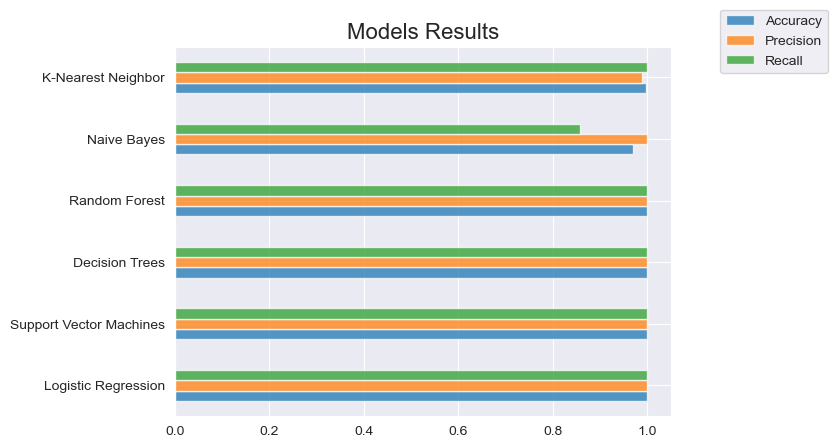

# Relax INC. 
### Take-Home Challenge

Relax Inc. makes productivity and project management software that's popular with both individuals and teams. Founded by several former Facebook employees, it's considered a great company to work for. 

An `adopted` user is defined as a user who has logged into the product on three separate days in at least one seven-day period. The goal is to identify which factors can better predict future user adoption.

Analyzing the data we can notice that users have logged in multiple days at different times. A total of 207,917 logins are recorded. 

The first summary table has a row for each day that a user logged into the product. 
| | |
|---|---|
| Total users | 8823 |
| Duplicated users | 0 |
| Logged in >= 3 tiimes | 8823 |

After some exploratory data analysis, We observed that 1,602 users have logged into the product on three separate days in at least one seven-day period. 

Analyzing the data on 12,000 users who signed up for the product in the last two years, we see that the majority of those accounts have been created by an invitation to an organization (as a full member). 

After running different models, we reach an accuracy of 99%.

Any model would work just fine. 

Analyzing all the features used, we conclude that `visited`, and `days_account_open` are the most influential ones. These two make sense because `visited` describes users that logged in on three separate days, and `days_account_open` represents the time from the creation of the account to the last login date. 